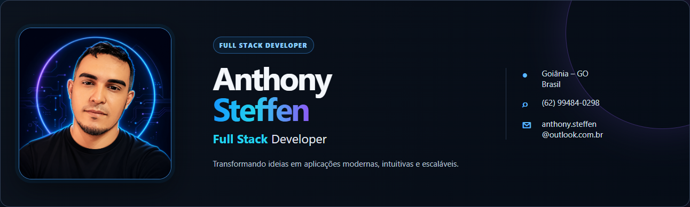
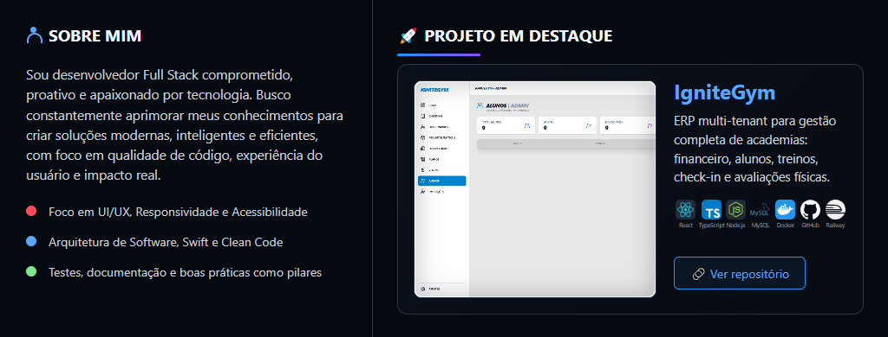
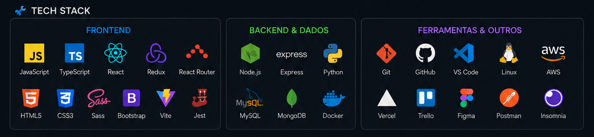
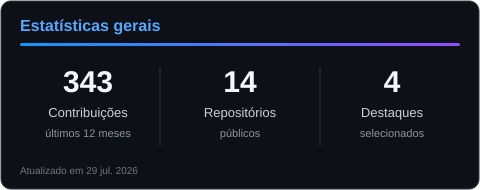
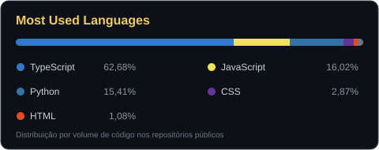
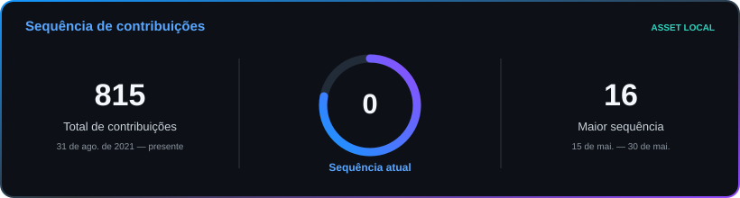
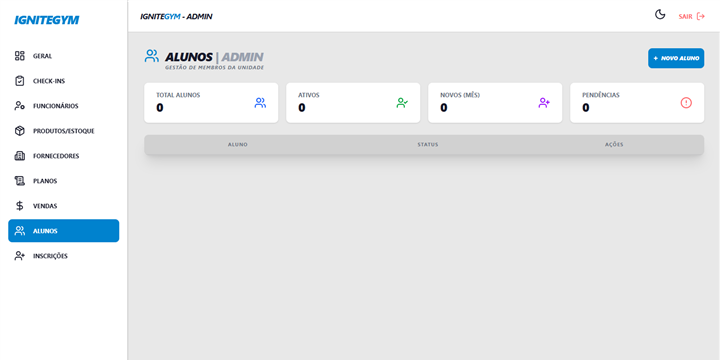
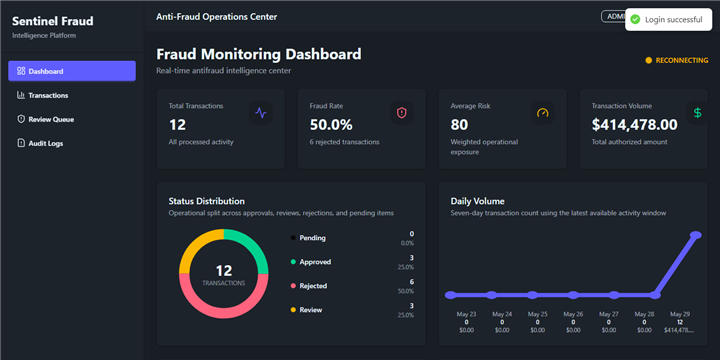
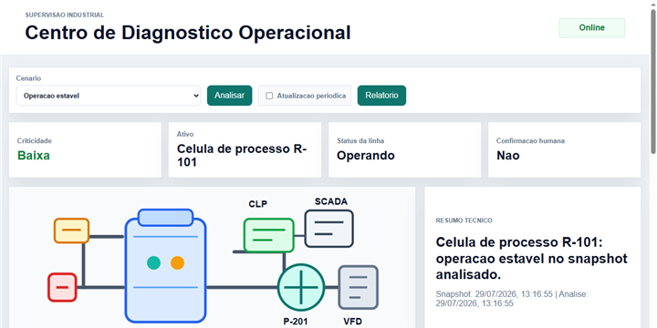
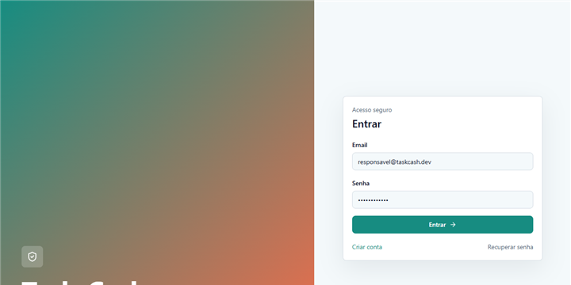

  

 

 

  

## 📊 GitHub Stats

  
  

  

  

## ⭐ Projetos

<table align="center">
  <tr>
    <td width="25%" align="center">
      
       
      <b>IgniteGym</b> Gestão para academias
    </td>
    <td width="25%" align="center">
      
       
      <b>Sentinel</b> Monitoramento antifraude
    </td>
    <td width="25%" align="center">
      
       
      <b>Industrial AI Supervisor</b> Diagnóstico operacional
    </td>
    <td width="25%" align="center">
      
       
      <b>Task_Cash</b> Tarefas e recompensas
    </td>
  </tr>
</table>

  

## 🤝 Conecte-se comigo

  
  
  
  
  

 

  “Código é como humor. Quando você tem que explicar, é ruim.” — Cory House

